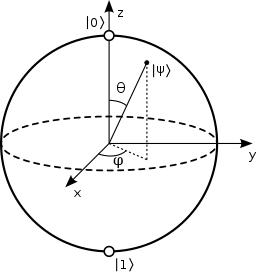
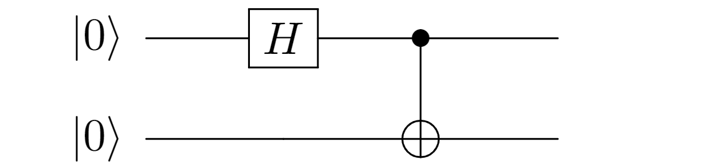

---
author:
- Valentin Taillandier
title: Quantum Computing Cheat Sheet
---

State vectors {#state-vectors .unnumbered}
=============

$$\ket{\psi} = \begin{pmatrix}
\cos \frac{\theta}{2}\\ 
e^{i \varphi } \sin \frac{\theta}{2}
\end{pmatrix}$$

$$\ket{0} = \begin{pmatrix}
1 \\
0
\end{pmatrix}$$ $$\ket{\text{+}} = \frac{\ket{0} + \ket{1}}{\sqrt{2}}$$
$$\ket{\text{+}'} = \frac{\ket{0} + i\ket{1}}{\sqrt{2}}$$

$$\ket{1} = \begin{pmatrix}
0 \\
1
\end{pmatrix}$$ $$\ket{\text{-}} = \frac{\ket{0} - \ket{1}}{\sqrt{2}}$$
$$\ket{\text{-}'} = \frac{\ket{0} - i\ket{1}}{\sqrt{2}}$$

Bloch sphere {#bloch-sphere .unnumbered}
============

$$\begin{pmatrix}
r_x \\
r_y \\
r_z
\end{pmatrix}
=
\begin{pmatrix}
\sin \theta \cos \varphi \\
\sin \theta \sin \varphi \\
\cos \theta
\end{pmatrix}$$

Pauli matrices {#pauli-matrices .unnumbered}
==============

$X = 
\begin{pmatrix}
0 & 1 \\ 
1 & 0 
\end{pmatrix}$ $Y = 
\begin{pmatrix}
0 & -i \\ 
i & 0 
\end{pmatrix}$ $Z = 
\begin{pmatrix}
1 & 0 \\ 
0 & -1 
\end{pmatrix}$

   $\Rsh\times$    $X$     $Y$     $Z$
  -------------- ------- ------- -------
                   $I$    $iZ$    $-iY$
                  $-iZ$    $I$    $iX$
                  $iY$    $-iX$    $I$

$$\begin{split}
X &= \ket{\text{+}}\bra{+} - \ket{\text{-}}\bra{\text{-}}\\
Y &= \ket{\text{+}'}\bra{\text{+}'} - \ket{\text{-}'}\bra{\text{-}'}\\
Z &= \ket{0}\bra{0} - \ket{1}\bra{1}\\
\end{split}$$

Rotations {#rotations .unnumbered}
=========

$$\begin{split}
R_x(\theta) &= e^{-i\theta X /2} = \cos{\frac{\theta}{2}}I - i\sin{\frac{\theta}{2}}X \\
R_y(\theta) &= e^{-i\theta Y /2} = \cos{\frac{\theta}{2}}I - i\sin{\frac{\theta}{2}}Y \\
R_z(\theta) &= e^{-i\theta Z /2} = \cos{\frac{\theta}{2}}I - i\sin{\frac{\theta}{2}}Z \\
\end{split}$$

Density matrix {#density-matrix .unnumbered}
==============

$$\rho = \ket{\psi}\bra{\psi}$$
$$\rho = \frac{1}{2}(I + \sin \theta \cos \varphi X + \sin \theta \sin \varphi Y + \cos \theta Z)$$
$$\rho = \frac{1}{2}(I + r_x X +  r_y Y + r_z Z)$$\
$\psi$ is a pure-state
$\Leftrightarrow Tr(\rho ^ 2) = 1 \Leftrightarrow r_x^2+ r_y^2 + r_z^2 = 1$

Tomography {#tomography .unnumbered}
==========

$$\begin{split}
r_x &= Tr(X\rho) = \bra{\text{+}}{\rho} \ket{\text{+}} - \bra{\text{-}}{\rho} \ket{\text{-}} = \mathbb{P}\ket{\text{+}}-\mathbb{P}\ket{\text{-}}\\
r_y &= Tr(Y\rho) = \bra{\text{+}'}{\rho} \ket{\text{+}'} - \bra{\text{-}'}{\rho} \ket{\text{-}'} = \mathbb{P}\ket{\text{+}'}-\mathbb{P}\ket{\text{-}'}\\
r_z &= Tr(Z\rho) = \bra{0}{\rho} \ket{0} - \bra{1}{\rho} \ket{1} = \mathbb{P}\ket{0}-\mathbb{P}\ket{1}
\end{split}$$

Gates {#gates .unnumbered}
=====

Hadamard Gate {#hadamard-gate .unnumbered}
-------------

The Hadamard Gate is a symmetry over the $x+z$ axis, which can be
decomposed in two rotations: $$H = 
\frac{1}{\sqrt{2}}\begin{pmatrix}
1 & 1\\ 
1 & -1
\end{pmatrix}
= \ket{\text{+}}\bra{0} + \ket{\text{-}}\bra{1}
= R_x(\frac{\pi}{2})R_z(\frac{\pi}{2})$$

Phase Gate {#phase-gate .unnumbered}
----------

$$S = 
\begin{pmatrix}
1 & 0\\ 
0 & i
\end{pmatrix}
= \ket{0}\bra{0} + i\ket{\text{1}}\bra{1}$$

Controlled Not (CNOT, CX) {#controlled-not-cnot-cx .unnumbered}
-------------------------

$$CX = 
\begin{pmatrix}
1 & 0 & 0 & 0\\ 
0 & 1 & 0 & 0 \\
0 & 0 & 0 & 1 \\
0 & 0 & 1 & 0
\end{pmatrix}
= 
\begin{pmatrix}
I & 0\\ 
0 & X

\end{pmatrix}$$

EPR pairs {#epr-pairs .unnumbered}
---------

The EPR pairs are the Bell states denoted by $\ket{\Phi ^+}$,
$\ket{\Phi ^-}$, $\ket{\Psi ^+}$ and $\ket{\Psi ^-}$.

$|\Phi^+\rangle = \frac{1}{\sqrt{2}} (|00\rangle_B + |11\rangle_B)$

